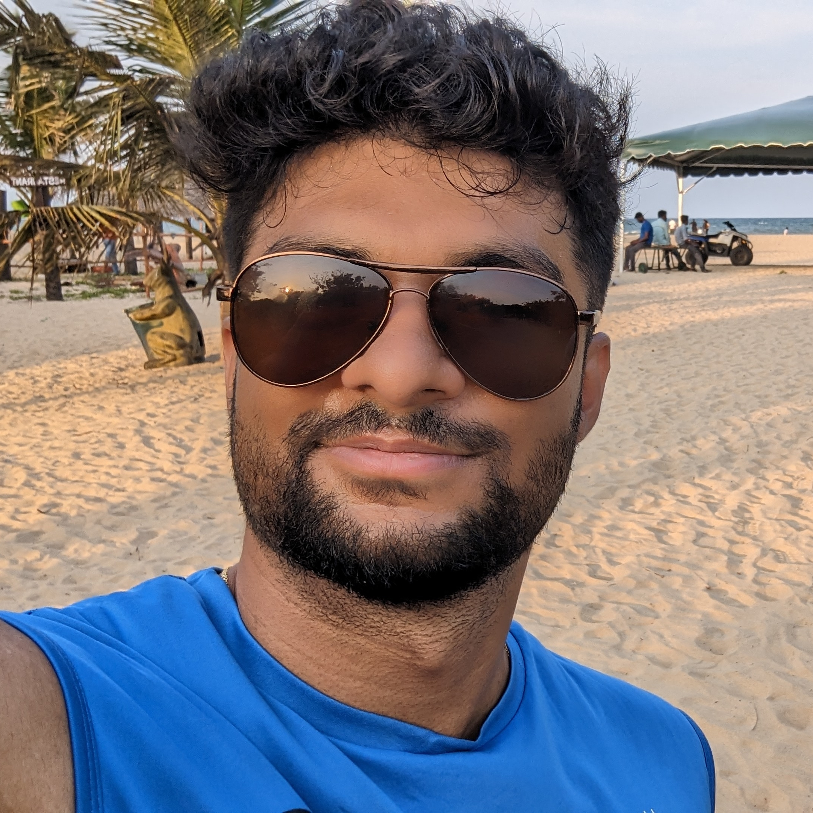

Hi, I'm Utkarsh Saxena, a software engineer from India and a lifelong learner. Computers have fascinated me since childhood, first as tools to explore and later as systems to understand deeply. I enjoy building useful software, learning how things work, and steadily getting better at the things I care about.

<figure id="about-profile">
  

    
  

  <figcaption class='caption'>A nice picture of me</figcaption>
</figure>

## Want more?

Stick around if you want to learn more, maybe checking out my [about](about) page.
